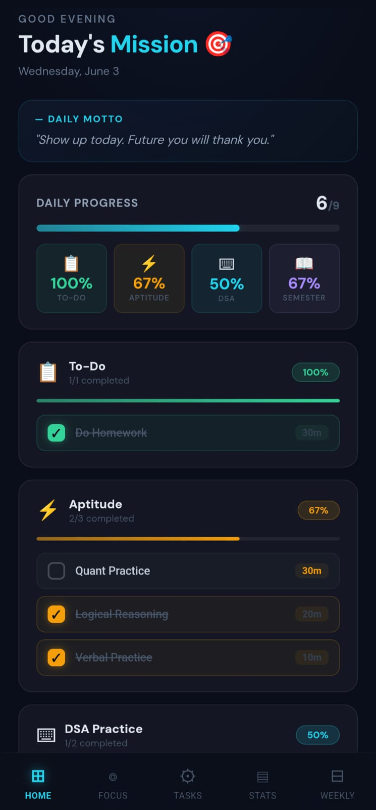

# 🚀 Growth Tracker

A clean and modern productivity app to track your daily goals, study progress, and consistency — available as a **web app** and **native Android app**.

## ✨ Features

### 📊 Daily Progress Tracking
- Section-wise task breakdown: **To-Do**, **Aptitude**, **DSA**, **Semester**
- Check off tasks — progress bars update in real time
- Per-section completion percentages at a glance

### 📋 To-Do List
- General daily tasks that **persist across days** (stay checked until manually unchecked)
- Add, delete, and manage all tasks in the **TASKS** tab
- View and check them off on the **HOME** screen

### 🎯 Task Management
- **Add / Delete** tasks anytime via the dedicated **TASKS** tab
- Choose name, duration, and section (To-Do / Aptitude / DSA / Semester)
- All tasks are saved automatically and survive page refresh

### ⏱️ Focus Timer
- Pomodoro-style timer with circular progress ring
- Quick presets: 10 / 20 / 30 / 40 minutes
- **Custom timer**: enter any duration manually
- **Browser notification** + beep sound when session completes
- Completed sessions are tracked in stats

### 📈 Progress Analytics (STATS tab)
- Total sessions completed
- DSA problems solved (auto-calculated from completed DSA tasks)
- Total study hours (accumulated from tasks + timer sessions)
- Day streak (auto-calculated from consistency log)
- Weekly consistency heatmap (last 7 days)

### 📅 Weekly Planner
- Editable day-wise schedule for Aptitude, DSA, and Semester topics
- Tap any topic to edit — saves automatically

### 🔥 Streak System
- Tracks daily consistency automatically
- Streak resets only on missed days
- Days with task completions or timer sessions count as active

### 💡 Motivational Quotes
- Random daily motto shown on the dashboard

### 🔄 Data Persistence
- All data saved to `localStorage` — **nothing resets on page refresh**
- Tasks, progress, weekly plan, streak, and stats all persist

### 📱 Native Android App
- Built with **Capacitor** — runs as a real Android app
- Splash screen, dark status bar, back button navigation
- Installable from APK / Play Store ready

## 🛠️ Tech Stack

- **React 18** + **TypeScript 5**
- **Vite 8** (build tool)
- **Capacitor 8** (native Android wrapper)
- **PWA** (service worker for offline support)
- **100% inline CSS** — no external UI libraries

## ⚙️ Web Installation

```bash
git clone https://github.com/aniket-diyewar/Growth-Tracker.git
cd Growth-Tracker
npm install
npm run dev
```

Open **http://localhost:5173** in your browser.

## 📱 Android Build (Capacitor)

### Prerequisites
- **Android Studio** (download from [developer.android.com/studio](https://developer.android.com/studio))
- USB debugging enabled on your phone (or use an emulator)

### Steps

```bash
npm run build
npx cap copy
npx cap open android
```

In **Android Studio**, click the green **▶ Run** button. The app will install on your connected device.

### Development Workflow

| Command | What it does |
|---------|-------------|
| `npm run dev` | Browser dev server (hot reload) |
| `npm run build && npx cap copy` | Build web app & sync to Android |
| `npx cap open android` | Open Android Studio |
| `npm run cap:build` | Build + sync + open (all in one) |

## 📱 App Preview

<table>
  <tr>
    <td align="center">
      
    </td>
    <td align="center">
      
    </td>
    <td align="center">
      
    </td>
  </tr>
</table>

## 📁 Project Structure

```
src/
├── StudyStack.tsx        # Main app (all screens & logic)
├── useLocalStorage.ts    # Persistence hook
├── notify.ts             # Beep + browser notification helper
├── App.tsx               # Entry component
├── main.tsx              # React root
assets/                   # App preview images
android/                  # Native Android project (Capacitor)
```

## 🧠 How It Works

- **Screens:** HOME, FOCUS, TASKS, STATS, WEEKLY — navigated via bottom tab bar
- **Daily reset:** Study tasks (Aptitude/DSA/Semester) reset each day; To-Do items persist
- **Streak:** Auto-calculated from trailing consecutive study days in your consistency log
- **Timer completion:** Triggers a browser notification + beep, adds session time to total hours

## 📄 License

MIT
