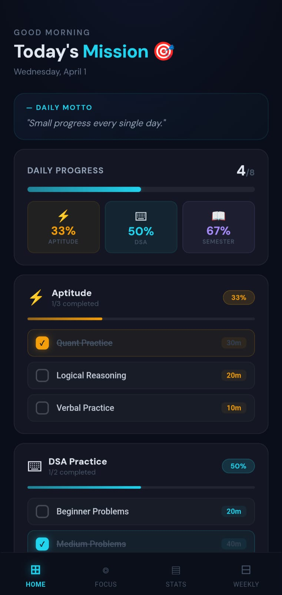
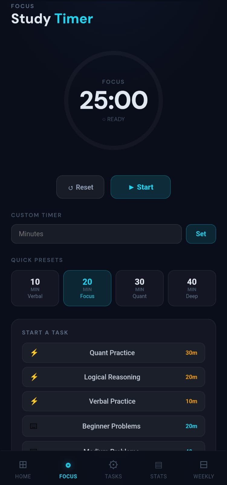
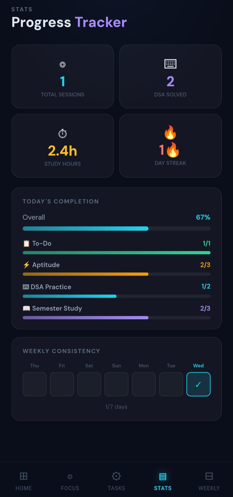

# 🚀 Growth Tracker

A clean and modern productivity web app to track your daily study goals, progress, and consistency.


## ✨ Features

- 📊 Daily Progress Tracking
- 🎯 Task-based Study Planning
- ⏱️ Focus Timer (Pomodoro style)
- 📈 Progress Analytics
- 📅 Weekly Planner
- 🔥 Streak System
- 💡 Motivational Quotes


## 🛠️ Tech Stack

- React + TypeScript
- Vite
- CSS (Custom UI)
- PWA Support


## ⚙️ Installation

```bash
git clone https://github.com/aniket-diyewar/Growth-Tracker.git
cd Growth-Tracker
npm install
npm run dev
```


## 📱App Preview 

<table>
  <tr>
    <td align="center">
      
    </td>
    <td align="center">
      
    </td>
    <td align="center">
      
    </td>
  </tr>
</table>
